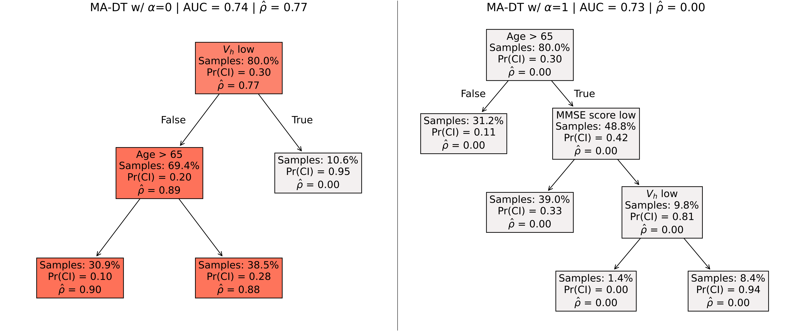

# Missingness-avoiding machine learning

Handling missing values at test time is challenging for machine learning models, especially when aiming for both high accuracy and interpretability. Existing approaches often introduce bias through imputation or increase model complexity via missingness indicators. Moreover, both strategies can obscure interpretability, making it harder to understand how the model uses observed variables in its predictions. We propose __missingness-avoiding (MA) machine learning__, a general framework for training models that rarely require the values of missing (or imputed) features at test time. We develop tailored MA learning algorithms for decision trees, tree ensembles, and sparse linear models by incorporating classifier-specific regularization terms into their learning objectives.

This repository contains the code used for the experiments presented in our paper [_Prediction models that learn to avoid missing values_](https://icml.cc/virtual/2025/poster/43980), which was featured as a spotlight poster at ICML 2025.

## A motivating example

When does MA learning achieve both low reliance on features with missing values and minimal prediction error? Consider the following data-generating process as a concrete example: Patients registered with a general healthcare provider undergo annual check-ups to assess their overall health. Demographic variables, such as patient age, are always recorded, whereas some test results may be missing due to clinical recommendations or practitioner discretion. For instance, cognitive tests are consistently administered to individuals over 65 years old, ensuring that [MMSE scores](https://en.wikipedia.org/wiki/Mini%E2%80%93mental_state_examination) are available for all patients in this age group. Patients who receive a low MMSE score subsequently undergo an MRI scan, which measures hippocampal volume ($V_h$) as either above or below average. MRI scans may also be ordered for unrelated clinical reasons—for example, to investigate spine or cartilage issues.

In the figure below (which can be reproduced by running the script  [`scripts/run_synthetic_experiment.py`](scripts/run_synthetic_experiment.py)), we show two examples of decision trees trained to predict whether a patient suffers from cognitive impairment using data collected by the healthcare provider. On the left, a standard decision tree is shown. It splits on the MRI scan outcome at the root node, resulting in high missingness reliance ($\hat{\rho}$), since this variable is unavailable for most patients. In contrast, the decision tree on the right is regularized to reduce reliance on features with missing values. This tree better reflects the underlying data-generating process and achieves zero missingness reliance while maintaining accuracy comparable to the standard tree.



## Table of contents
- [Installation](#installation)
- [The MA learning framework](#the-ma-learning-framework)
- [Configuration files](#configuration-files)
- [Datasets](#datasets)
- [Experiments](#experiments)
- [Tetralith setup](#tetralith-setup)
- [Citation](#citation)
- [Acknowledgements](#acknowledgements)

## Installation

To get started, clone the repository and install the required packages in a new environment. We use [Pixi](https://pixi.sh/latest/) to manage Python dependencies. Make sure Pixi is installed by running:
```bash
pixi --version
```

To set up a working environment, run the following commands:
```bash
git clone https://github.com/antmats/malearn.git
cd malearn
pixi install
```

The `pixi install` command installs the CPU version of PyTorch, which is used in the implementation of the [NeuMiss network](https://proceedings.neurips.cc/paper_files/paper/2020/hash/42ae1544956fbe6e09242e6cd752444c-Abstract.html) – a baseline used in our experiments. To enable GPU support, run `pixi install -e cuda`.

__Note:__ The implementation of [M-GAM](https://openreview.net/forum?id=soUXmwL5aK) – another baseline included in our experiments – depends on [`fastsparsegams`](https://pypi.org/project/fastsparsegams/), which is only available via PyPI. On macOS machines, installing `fastsparsegams` may fail due to the issue described [here](https://pixi.sh/latest/python/pytorch/#mixing-macos-and-cuda-with-pypi-dependencies). If you encounter this problem, you can comment out the `pypi-dependencies` section in [`pixi.toml`](pixi.toml) to create an environment without support for running M-GAM.

To run all tests in the `tests` directory:
```bash
pixi run test
```

To launch a Jupyter notebook:
```bash
pixi run jupyter lab
```

## The MA learning framework

The MA learning framework supports sparse linear models (MA-Lasso), decision trees (MA-DT), and ensemble methods in the form of random forests (MA-RF) and gradient-boosted decision trees (MA-GBT). Currently, we have implemented all algorithms for classification, while for regression, we support MA-Lasso and MA-DT.

| MA estimator | Classification                                                   | Regression                                               |   
|--------------|------------------------------------------------------------------|----------------------------------------------------------|
| MA-Lasso     | [`MALassoClassifier`](malearn/estimators/classification.py#L370) | [`MALasso`](malearn/estimators/regression.py#L259)       |
| MA-DT        | [`MADTClassifier`](malearn/estimators/classification.py#L394)    | [`MADTRegressor`](malearn/estimators/regression.py#L275) |
| MA-RF        | [`MARFClassifier`](malearn/estimators/classification.py#L502)    | -                                                        |
| MA-GBT       | [`MAGBTClassifier`](malearn/estimators/classification.py#L864)   | -                                                        |

All estimators follow the fit/predict convention used in scikit-learn. Thus, they can be easily integrated into the scikit-learn ecosystem – for example, as part of a pipeline and/or within a hyperparameter search. However, since each MA estimator requires not only the input features $X$ and targets $y$, but also the missingness mask $M$ as input to its `fit` method, [metadata routing](https://scikit-learn.org/stable/metadata_routing.html) must be enabled when using the estimator within a meta-estimator. See [`scripts/run_synthetic_experiment.py`](scripts/run_synthetic_experiment.py) for an example of how to use MA-DT.

__Note:__ The current decision tree implementations are not optimized for speed and are relatively slow compared to their scikit-learn counterparts. We aim to improve these implementations in future updates.

## Configuration files

We use configuration files to specify details such as dataset paths, evaluation metrics, and hyperparameters. There are two configuration files: one for classification ([`config_cla.yml`](config_cla.yml)) and one for regression ([`config_reg.yml`](config_reg.yml)). You should update the `base_dir` field to point to a directory on your machine where the datasets are stored (under the subdirectory specified by `data_dir`). Results will be saved in `base_dir`/`results_dir`.

## Datasets

We consider six different datasets for classification in our paper: ADNI, Breast Cancer, FICO, LIFE, NHANES, and Pharyngitis. In the following subsections, we describe how to download each dataset. In [`malearn/data/data.py`](malearn/data/data.py), there is a corresponding data handler class for each dataset. Each data handler defines the features to include for modeling, the target variable, and the name of the dataset file. Make sure the `file_name` attribute corresponds to the name of the dataset file on your own machine.

### ADNI

To use ADNI, you must first apply for access [here](https://adni.loni.usc.edu/data-samples/adni-data/#AccessData). After gaining access, follow these steps:
1. Log in to the [Image and Data Archive](https://ida.loni.usc.edu/login.jsp).
2. Under "Select Study", choose "ADNI". Then choose "Download > Study Data" and search for "ADNIMERGE".
3. Download the file "ADNIMERGE - Key ADNI tables merged into one table - Packages for R [ADNI1,GO,2]".
4. Install the ADNIMERGE package for R by following the instructions [here](https://adni.bitbucket.io/index.html).
5. Load the data and save it to a CSV file by running the R script below:
```R
library(ADNIMERGE)
data <- adnimerge
write.csv(data, file="/path/to/my/adni/data.csv", row.names=FALSE)
```

### Breast Cancer

The Breast Cancer dataset was used in [this paper](https://www.nature.com/articles/s43856-023-00356-z) by Shadbahr et al. To obtain the dataset, download `Breast_cancer_data.xlsx` from [their project repository](https://gitlab.developers.cam.ac.uk/maths/cia/covid-19-projects/handling_missing_data/-/tree/main/DATA/BREAST_CANCER?ref_type=heads).

### FICO

The FICO dataset was used in the 2018 [Explainable Machine Learning Challenge](https://community.fico.com/s/explainable-machine-learning-challenge). Download `heloc_dataset_v1.csv` from [this GitHub repository](https://github.com/benoitparis/explainable-challenge/tree/master).

### LIFE

The LIFE dataset can be downloaded from [this Kaggle project](https://www.kaggle.com/datasets/kumarajarshi/life-expectancy-who).

### NHANES

The NHANES dataset can be obtained by following the instructions provided in [this GitHub repository](https://github.com/Healthy-AI/nhanes_tasks).

### Pharyngitis

The Pharyngitis dataset is available as supplementary material for [this article](https://journals.plos.org/plosone/article?id=10.1371/journal.pone.0172871#sec006).
Search for "minimal dataset" to locate the file.

## Experiments

The experimental settings are defined in the configuration files as described above. The script [`scripts/fit_estimator.py`](scripts/fit_estimator.py) can be used to fit and evaluate a single model. For example, to fit MA-Lasso to the ADNI dataset, run:
```python
pixi run python scripts/fit_estimator.py --config_path config_cla.yml --dataset_alias adni --estimator_alias malasso
```

In our paper, we conduct comprehensive experiments on all datasets. All experiments were performed on the [Tetralith cluster](https://www.nsc.liu.se/systems/tetralith/) using [Apptainer containers](https://apptainer.org/docs/user/latest/); see below for details. The scripts [`scripts/slurm/run_experiment_wrapper.sh`](scripts/slurm/run_experiment_wrapper.sh) and [`scripts/slurm/run_experiment.sh`](scripts/slurm/run_experiment.sh) were used to launch each experiment. If you have access to a cluster that uses Slurm for job scheduling, you can reproduce all our experiments by updating the relevant Slurm parameters in [`scripts/slurm/run_experiment.sh`](scripts/slurm/run_experiment.sh). No changes are required for [`scripts/slurm/run_experiment_wrapper.sh`](scripts/slurm/run_experiment_wrapper.sh). Depending on your cluster setup, you may also need to modify the Slurm batch script ([`scripts/slurm/fit_estimator.sh`](scripts/slurm/fit_estimator.sh)) to, e.g., map host storage directories into the container environment.

- To reproduce the results shown in the main table (Table 1) of the paper, run the following commands:
```bash
./scripts/slurm/run_experiment_wrapper.sh config_cla.yml adni all
./scripts/slurm/run_experiment_wrapper.sh config_cla.yml fico all
./scripts/slurm/run_experiment_wrapper.sh config_cla.yml life all
./scripts/slurm/run_experiment_wrapper.sh config_cla.yml nhanes all
```

- To fit MA models with the setting $\alpha=0$, run:
```bash
./scripts/slurm/run_experiment_wrapper.sh config_cla.yml <dataset> ma_alpha_0
```

- To fit MA models with the setting $\alpha=\infty$, update the `model_selection` field in the configuration file as follows:
```yaml
model_selection:
  search: random
  n_iter: 10
  scoring: [missingness_reliance_score, roc_auc_ovr]
  refit: tradeoff
  gamma: 1
  n_splits: 3
  test_size: 0.2
  seed: *seed
```
Then, run:
```bash
./scripts/slurm/run_experiment_wrapper.sh config_cla.yml <dataset> ma
```

For further details and post-processing of the results, we refer to the notebook [`notebooks/paper_results.ipynb`](notebooks/paper_results.ipynb).

## Tetralith setup

Here, we explain how to set up a working environment on the Tetralith cluster, run the default set of experiments on the ADNI dataset, and launch a Jupyter notebook on Tetralith that you can access through a browser on your local machine. We assume that you have access to a project storage directory, and that the path to this directory can be obtained using `$projdir`.

__Clone the repository:__
```bash
cd ~
git clone https://github.com/antmats/malearn.git
```

__Build a container:__
```bash
cd "$projdir"
mkdir -p malearn/containers && cd malearn/containers
apptainer build --bind $HOME:/mnt ma_env.sif ~/malearn/container.def
```

__Run an experiment:__
```bash
cd ~/malearn
./scripts/slurm/run_experiment_wrapper.sh config_cla.yml adni all
```

__Launch a notebook:__

1. Start a Jupyter server:
```bash
container="${projdir}/malearn/containers/ma_env.sif"
apptainer exec --bind /proj:/proj,$HOME:/mnt "$container" jupyter-lab --no-browser --LabApp.extension_manager=readonly
```

2. Create an SSH tunnel (make sure the port is 8889):
```bash
ssh -N -L localhost:8889:localhost:8889 <username>@tetralith.nsc.liu.se
```

3. Copy and paste the URL on Tetralith into your browser.

## Citation

If you use this work, please cite it as follows:
```bib
@inproceedings{
  stempfle2025prediction,
  title={Prediction models that learn to avoid missing values},
  author={Lena Stempfle and Anton Matsson and Newton Mwai and Fredrik D. Johansson},
  booktitle={Forty-second International Conference on Machine Learning},
  year={2025},
  url={https://openreview.net/forum?id=ps3aO9MHJv}
}
```

## Acknowledgements

This work was partially supported by the Wallenberg AI, Autonomous Systems and Software Program
(WASP) funded by the Knut and Alice Wallenberg Foundation.

The computations and data handling were enabled by resources provided by the National Academic Infrastructure for Supercomputing in Sweden (NAISS), partially funded by the Swedish Research Council through grant agreement no. 2022-06725.
